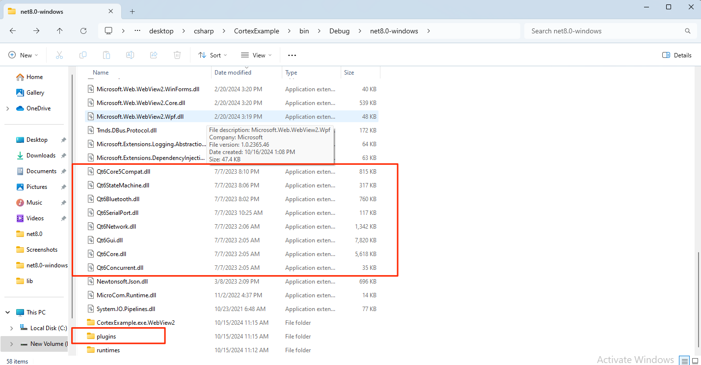

# CortexExample

This repository contains a sample application demonstrating the use of the Emotiv Cortex SDK with Avalonia UI in a .NET 8.0 environment. The application provides a basic interface to interact with the Emotiv Cortex API, allowing users to log in, query headsets, and manage sessions.

## Prerequisites

Before you begin, ensure you have met the following requirements:
- .NET 8.0 SDK installed on your machine.
- Visual Studio 2022 or later / Visual Studio Code.
- Emotiv Cortex SDK.
- Avalonia UI packages.
- [Emotiv Cortex API](https://emotiv.gitbook.io/cortex-api/)

## Usage

1. Open the solution in your preferred IDE (Visual Studio or Visual Studio Code).

2. Build the solution:
    ```sh
    dotnet build
    ```

3. Run the application:
    ```sh
    dotnet run
    ```

## Project Structure

- `MainWindow.axaml.cs`: Contains the main logic for interacting with the Emotiv Cortex API.


## Key Functionalities

- **Login**: Logs into the Emotiv Cortex service.
- **Get User Info**: Retrieves information about the logged-in user.
- **Query Headset**: Queries connected headsets.
- **Connect Headset**: Connects to a specified headset.
- **Create Session**: Creates a new session with the connected headset.
- **Subscribe Data**: Subscribes to data streams from the headset.
- **Unsubscribe Data**: Unsubscribes from data streams.

## Configuration

The project is configured to use Avalonia UI for the user interface and includes several essential packages such as `Newtonsoft.Json` for JSON handling and `Microsoft.Web.WebView2` for web view integration.

## Important Note

- Before running the application, ensure that you copy the Emotiv Cortex library to the folder containing the executable file. Failure to do so will result in the application being unable to run.



- Fill your client_id/secret/license_id in class `EmotivCortex.cs` 